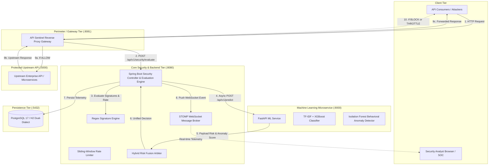

# API Sentinel — System Architecture

## 1. Architectural Overview

API Sentinel is an enterprise-grade API Intrusion Detection and Adaptive Security Platform. It provides zero-latency inline threat mitigation, deep payload inspection, behavioral anomaly detection, and real-time security operations (SOC) telemetry.



---

## 2. Component Directory & Service Responsibilities

| Service | Port | Technology | Primary Responsibilities |
| :--- | :--- | :--- | :--- |
| **API Gateway** | `8081` | Node.js / Express / Axios | High-performance reverse proxy interceptor. Evaluates incoming traffic via core security endpoint before proxying downstream to target APIs. Enforces blocking and rate limits. |
| **Backend & Evaluation Engine** | `8080` | Spring Boot 3.3.4 / Java 21 | Central nervous system: Authentication, RBAC, JPA persistence, regex signature evaluation, sliding-window rate tracking, ML bridge, STOMP broker, and REST APIs. |
| **ML Intelligence Service** | `8000` | FastAPI / Python 3.12 | Dedicated machine learning inference engine. Runs TF-IDF payload vectorization, XGBoost multi-class threat classifier, and Isolation Forest anomaly detector. |
| **SOC Dashboard Frontend** | `3000` | React 18 / TypeScript / Vite / TailwindCSS | High-density SOC console featuring dark-first interface, interactive threat timeline, request deep-inspector, analytics, live attack simulations, and audit logs. |
| **Demo Target API** | `5000` | Node.js / Express | Realistic enterprise e-commerce API serving products, user auth, feedback submissions, and file downloads. Used for attack simulation and policy validation. |
| **PostgreSQL Database** | `5432` | PostgreSQL 17 Alpine | Relational persistence for users, organizations, applications, API keys, protected endpoints, traffic telemetry, threat events, incidents, and audit trails. |

---

## 3. Inline Security Decision Pipeline

Every incoming request processed through the API Sentinel gateway traverses a strict 4-stage pipeline:

```
[ Incoming Request ]
         │
         ▼
[ Stage 1: Signature & Rule Verification ]
         │  ├── SQL Injection patterns (UNION, SELECT, --, /*)
         │  ├── Cross-Site Scripting (XSS) scripts and event handlers
         │  ├── Path Traversal (../, etc/passwd, windows/win.ini)
         │  └── Command Injection (|, ;, &&, bash -c)
         │
         ▼
[ Stage 2: Sliding-Window Rate Tracking ]
         │  ├── Tracks IP requests per 60-second rolling window
         │  └── Flags brute-force or rapid credential stuffing
         │
         ▼
[ Stage 3: ML Intelligence Evaluation ]
         │  ├── Anomaly Score: Isolation Forest behavioral divergence (0.00 - 1.00)
         │  ├── Payload Score: Supervised XGBoost classifier probability
         │  └── Threat Classification: SQLI, XSS, BRUTE_FORCE, PATH_TRAVERSAL, BENIGN
         │
         ▼
[ Stage 4: Hybrid Risk Fusion & Decision ]
         │  ├── Unified Risk Formula:
         │  │     Risk = 0.40 * Signature + 0.35 * Payload + 0.25 * Anomaly
         │  ├── Risk < 35  ──► ALLOW     (Pass upstream with X-Sentinel-Risk)
         │  ├── Risk 35-64 ──► CHALLENGE (MFA or CAPTCHA requirement)
         │  ├── Risk 65-84 ──► THROTTLE  (HTTP 429 Too Many Requests)
         │  └── Risk >= 85 ──► BLOCK     (HTTP 403 Forbidden with security report)
```

---

## 4. Real-time Telemetry & Event Streaming

The backend integrates an embedded Spring STOMP WebSocket broker (`/ws`) utilizing native fallback SockJS. Upon computing any security decision:

1. **Traffic Stream (`/topic/traffic`)**: Emits `RequestEventDto` containing latency, method, path, risk score, decision, and IP.
2. **Threat Stream (`/topic/threats`)**: Emits `ThreatEventDto` for any transaction exceeding the warning threshold (Risk >= 40) or triggering deterministic signatures.
3. **Incident Stream (`/topic/incidents`)**: Automatically groups repeated high-severity threats matching source IP and application within a 15-minute sliding window into an actionable `Incident`.
4. **Notification Stream (`/topic/notifications`)**: Broadcasts urgent security alerts to active SOC operators.
