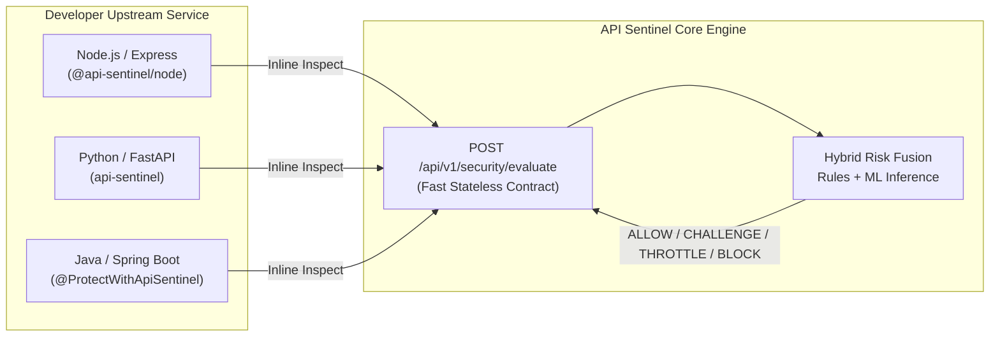

# API Sentinel — Future SDK & Middleware Architecture

## 1. Vision & Architectural Principle

API Sentinel is currently deployed as a **Dual Perimeter Platform**: an inline Reverse Proxy Gateway and an interactive SOC Dashboard. 

The core evaluation engine (`POST /api/v1/security/evaluate`) is engineered from the ground up as a **universal security contract** to enable frictionless migration into native client SDKs and framework middleware without modifying the core platform.



---

## 2. Universal Security Evaluation Contract

Developer SDKs do **not** interact with machine learning models (XGBoost, TF-IDF, or Isolation Forest). Instead, SDKs communicate strictly with a clean, high-performance evaluation contract:

### Contract Specification
- **Endpoint**: `POST /api/v1/security/evaluate`
- **Request Headers**: `X-API-Key: sentinel_live_...`
- **Payload Schema**:
  ```json
  {
    "applicationId": "app_ecommerce_prod",
    "method": "POST",
    "endpoint": "/api/v1/orders",
    "clientIp": "198.51.100.22",
    "userAgent": "Mozilla/5.0 ...",
    "headers": {
      "authorization": "Bearer <sanitized>",
      "content-type": "application/json"
    },
    "payload": "{\"orderId\": 1029, \"coupon\": \"' OR 1=1--\"}"
  }
  ```
- **Response Schema**:
  ```json
  {
    "requestId": "req_6c8d20e791b4",
    "decision": "BLOCK",
    "riskScore": 91.2,
    "attackType": "SQL_INJECTION",
    "anomalyScore": 0.85,
    "payloadScore": 0.93,
    "confidence": 0.95,
    "triggeredRules": ["RULE-SQLI-001"],
    "reasons": ["SQL UNION SELECT signature matched"],
    "modelVersion": "1.0.0-xgb-iso",
    "inferenceLatencyMs": 12
  }
  ```

---

## 3. Future SDK Implementations (Target Designs)

### A. Node.js / Express Middleware (`@api-sentinel/node`)
*(Labeled Coming Soon in UI)*

```javascript
import express from 'express';
import { apiSentinel } from '@api-sentinel/node';

const app = express();
app.use(express.json());

// One-line API Sentinel protection
app.use(apiSentinel({
  apiKey: process.env.SENTINEL_API_KEY,
  applicationId: 'app_ecommerce_prod',
  onBlock: (req, res, decision) => {
    res.status(403).json({
      error: 'Access Denied by API Sentinel',
      incidentId: decision.requestId
    });
  }
}));

app.post('/api/orders', (req, res) => {
  res.json({ status: 'Order created' });
});
```

---

### B. Python / FastAPI Middleware (`api-sentinel`)
*(Labeled Coming Soon in UI)*

```python
from fastapi import FastAPI
from api_sentinel.middleware import ApiSentinelMiddleware

app = FastAPI()

app.add_middleware(
    ApiSentinelMiddleware,
    api_key="sentinel_live_e8a93bf409c7429d8a113200ff921bb4",
    application_id="app_ecommerce_prod",
    mode="ENFORCE" # or "MONITOR"
)
```

---

### C. Java / Spring Boot Starter (`api-sentinel-spring-boot-starter`)
*(Labeled Coming Soon in UI)*

```java
@RestController
@RequestMapping("/api/payments")
public class PaymentController {

    @PostMapping("/charge")
    @ProtectWithApiSentinel(threatThreshold = 80, challengeAction = ChallengeType.MFA)
    public ResponseEntity<PaymentReceipt> charge(@RequestBody ChargeRequest request) {
        return ResponseEntity.ok(paymentService.process(request));
    }
}
```

---

## 4. Local Caching & Resiliency Fallback (Edge SDKs)

Future SDKs will include an embedded lightweight LRU signature cache:
1. **Circuit Breaker**: If network connectivity to the API Sentinel central backend is momentarily degraded, the SDK safely falls back to local regex heuristic rules without blocking genuine user traffic.
2. **Asynchronous Telemetry Buffering**: Allows zero-latency evaluation for `ALLOW` decisions while streaming full forensic telemetry out-of-band via background worker threads.
