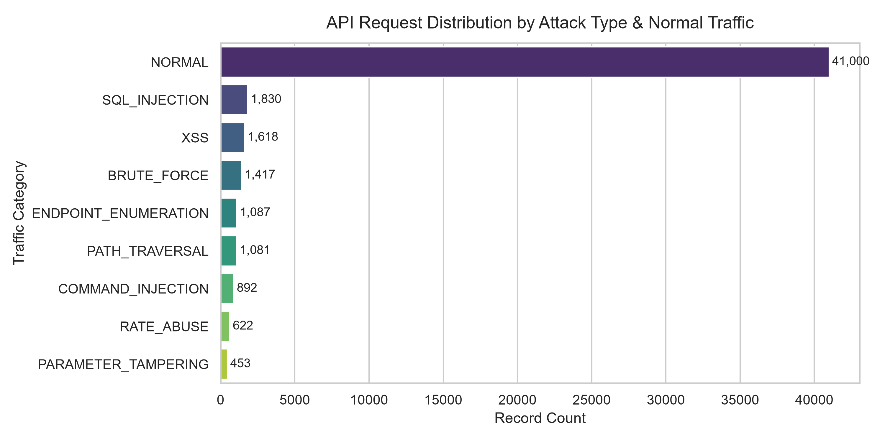
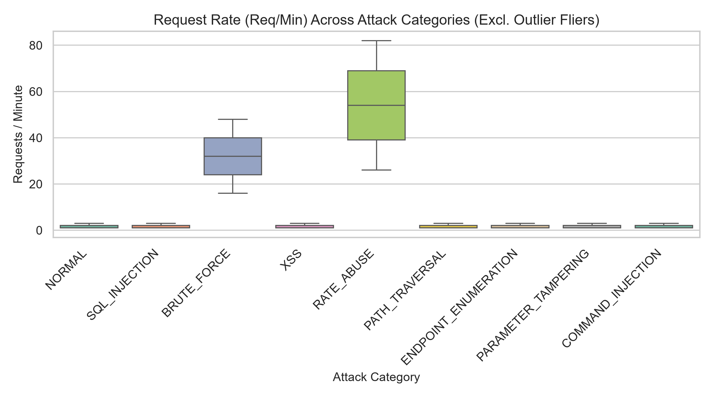
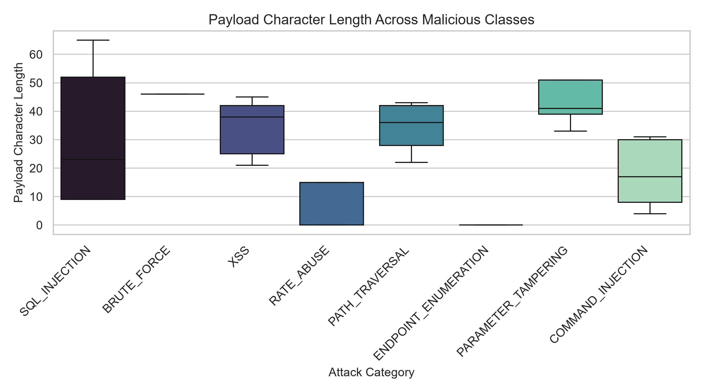
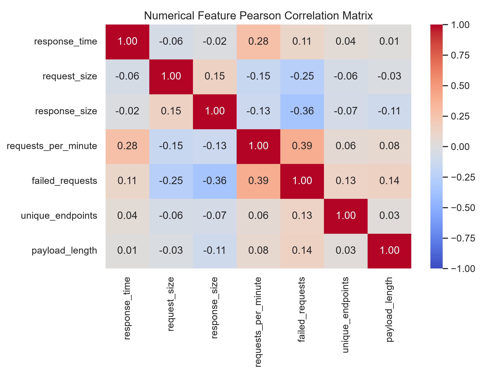
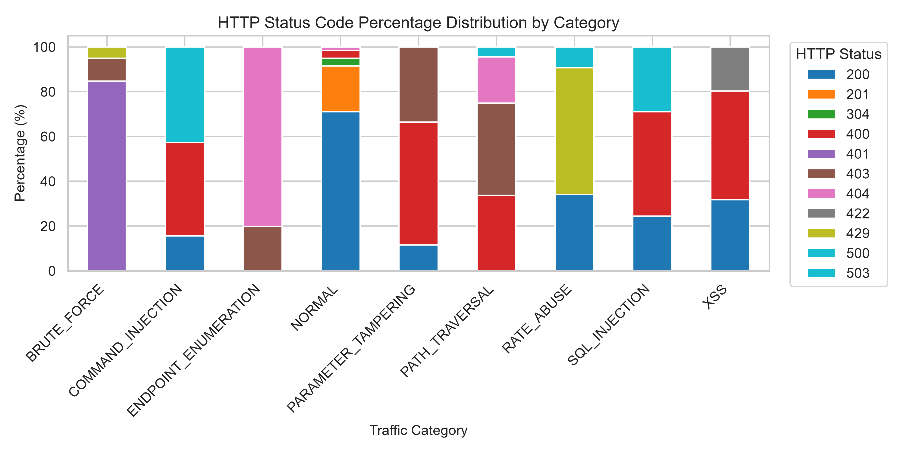

# Exploratory Data Analysis (EDA) & Data Quality Report

## 1. Dataset Overview
- **Total Records:** 50,000
- **Total Attributes:** 18
- **Attributes:** `timestamp, source_ip, method, endpoint, status_code, response_time, request_size, response_size, user_agent, authentication_status, user_id, requests_per_minute, failed_requests, unique_endpoints, payload, label, attack_type, payload_length`

---

## 2. Data Quality & Integrity Audit
### Missing Values
| Column | Missing Count | Missing Percentage (%) | Preprocessing Decision |
| :--- | :--- | :--- | :--- |
| `timestamp` | 0 | 0.00% | Clean (0 missing) |
| `source_ip` | 0 | 0.00% | Clean (0 missing) |
| `method` | 0 | 0.00% | Clean (0 missing) |
| `endpoint` | 0 | 0.00% | Clean (0 missing) |
| `status_code` | 0 | 0.00% | Clean (0 missing) |
| `response_time` | 0 | 0.00% | Clean (0 missing) |
| `request_size` | 0 | 0.00% | Clean (0 missing) |
| `response_size` | 0 | 0.00% | Clean (0 missing) |
| `user_agent` | 736 | 1.47% | Clean (0 missing) |
| `authentication_status` | 0 | 0.00% | Clean (0 missing) |
| `user_id` | 15,000 | 30.00% | Expected null for unauthenticated/anonymous calls |
| `requests_per_minute` | 0 | 0.00% | Clean (0 missing) |
| `failed_requests` | 0 | 0.00% | Clean (0 missing) |
| `unique_endpoints` | 0 | 0.00% | Clean (0 missing) |
| `payload` | 24,096 | 48.19% | Clean (0 missing) |
| `label` | 0 | 0.00% | Clean (0 missing) |
| `attack_type` | 0 | 0.00% | Clean (0 missing) |

### Duplicate Records
- **Exact duplicate rows:** 0 (Clean, no unexpected duplication).

### Statistical Outlier Analysis (1.5 × IQR Rule)
| Numerical Attribute | IQR Outlier Count | Analytical Context |
| :--- | :--- | :--- |
| `response_time` | 2,681 | Reflects authentic traffic bursts or heavy payload anomalies |
| `request_size` | 0 | Reflects authentic traffic bursts or heavy payload anomalies |
| `response_size` | 0 | Reflects authentic traffic bursts or heavy payload anomalies |
| `requests_per_minute` | 2,259 | Reflects authentic traffic bursts or heavy payload anomalies |
| `failed_requests` | 5,925 | Reflects authentic traffic bursts or heavy payload anomalies |
| `unique_endpoints` | 3 | Reflects authentic traffic bursts or heavy payload anomalies |

---

## 3. Label & Category Distributions

### Class Distribution (Binary)
| Class Label | Count | Proportion |
| :--- | :--- | :--- |
| **NORMAL** | 41,000 | 82.00% |
| **MALICIOUS** | 9,000 | 18.00% |

### Multi-Class Attack Distribution
| Traffic / Attack Type | Count | Proportion | Modality |
| :--- | :--- | :--- | :--- |
| `NORMAL` | 41,000 | 82.00% | Benign Baseline |
| `SQL_INJECTION` | 1,830 | 3.66% | Behavioral + Payload |
| `XSS` | 1,618 | 3.24% | Payload Focused |
| `BRUTE_FORCE` | 1,417 | 2.83% | Behavioral Only |
| `ENDPOINT_ENUMERATION` | 1,087 | 2.17% | Behavioral Only |
| `PATH_TRAVERSAL` | 1,081 | 2.16% | Payload Focused |
| `COMMAND_INJECTION` | 892 | 1.78% | Behavioral + Payload |
| `RATE_ABUSE` | 622 | 1.24% | Behavioral Only |
| `PARAMETER_TAMPERING` | 453 | 0.91% | Behavioral + Payload |

---

## 4. Key Visualizations

1. **Attack Type Distribution:**
   

2. **Behavioral Request Rate (Req/Min):**
   

3. **Payload Length Profile:**
   

4. **Feature Correlation Heatmap:**
   

5. **HTTP Status Code Breakdown:**
   

---

## 5. Research Conclusions & Feature Engineering Strategy
1. **Multi-Modal Signals:** Pure payload models will completely miss attacks that have empty or benign payloads (e.g., `ENDPOINT_ENUMERATION`, `RATE_ABUSE`, `BRUTE_FORCE`). This mathematically necessitates behavioral anomaly detection.
2. **Behavioral Signals:** High `requests_per_minute`, elevated `failed_requests`, and extreme `unique_endpoints` strongly isolate automated probing and brute force attacks.
3. **Payload Distinctions:** Injection attacks (`SQL_INJECTION`, `XSS`, `COMMAND_INJECTION`, `PATH_TRAVERSAL`) exhibit distinct lexical tokens (quotes, angle brackets, directory separators, shell metacharacters), making character and word n-gram TF-IDF highly discriminative.
